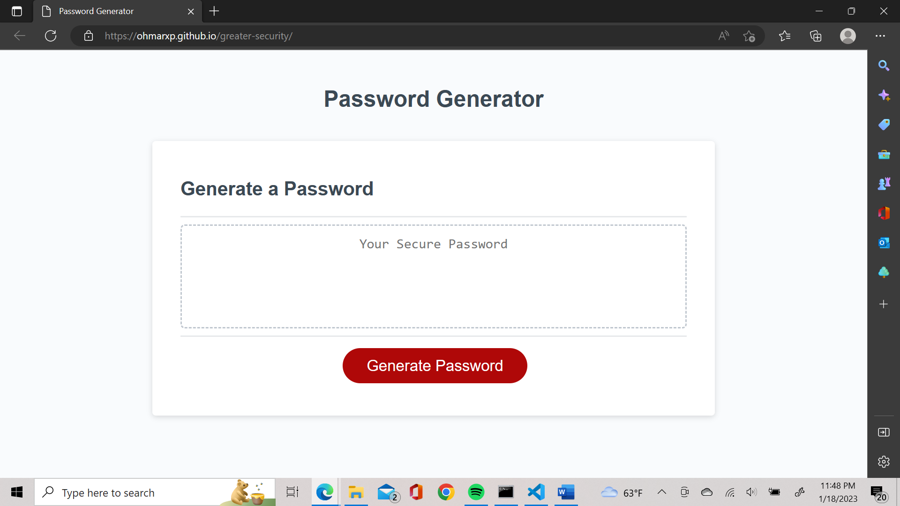

# Greater Security

## Description

This project is the third challenge assignmet for boot camp students. In this project, a starter JavaScript code was provided, together with a complete html and CSS files. The started code required additional modification in order for the password generator to work.

## Usage

To use the password generator, click the button labeled "Generate Password" and fill in the options for your password.

## Credits

Link to deployed application: https://ohmarxp.github.io/greater-security/

Starter code can be found here: https://github.com/coding-boot-camp/friendly-parakeet

## License

N/A
